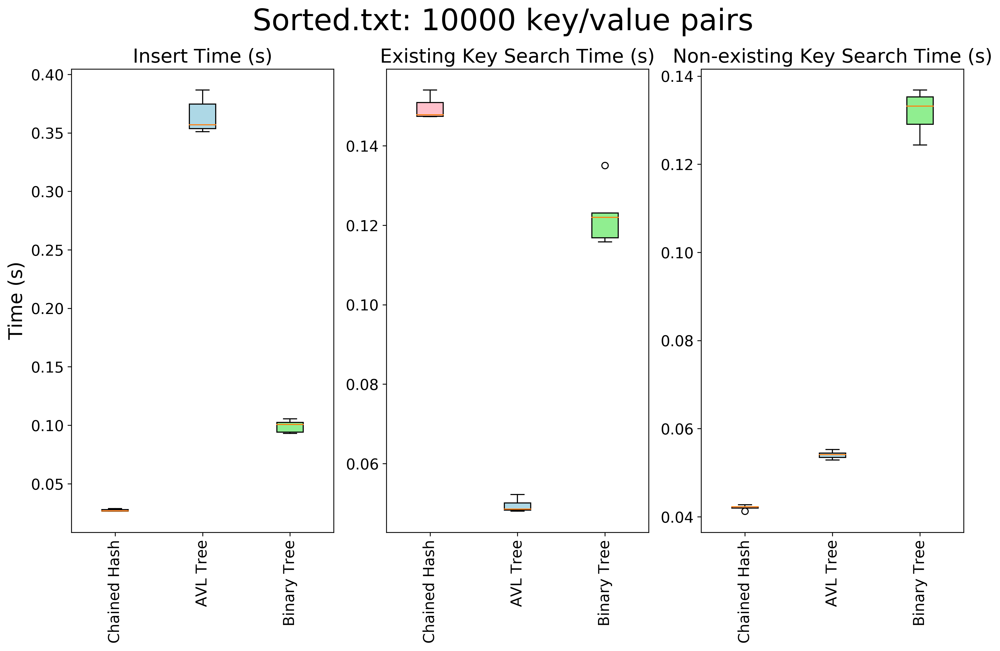
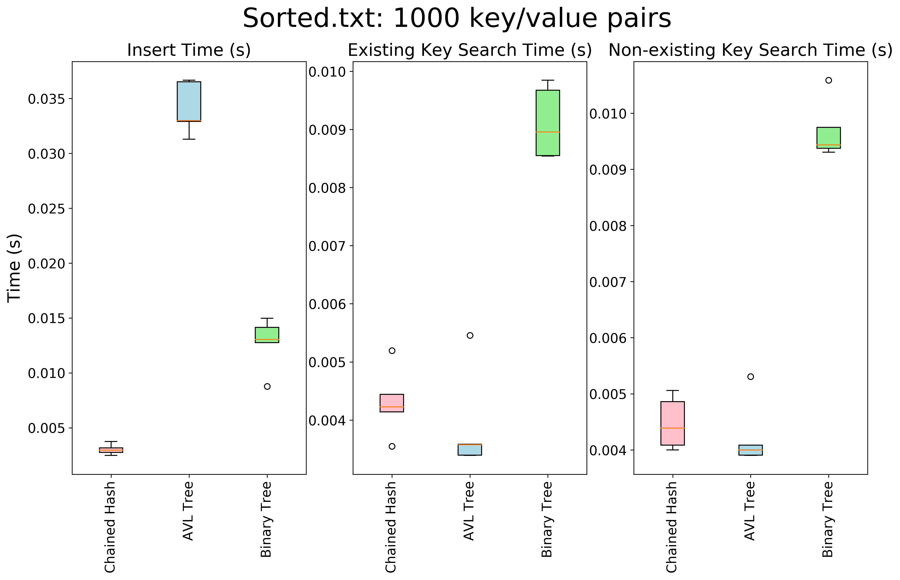
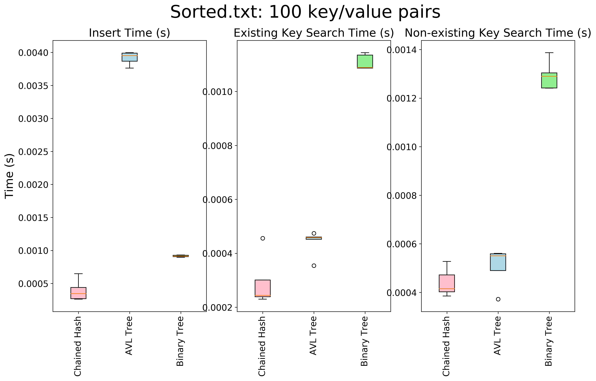
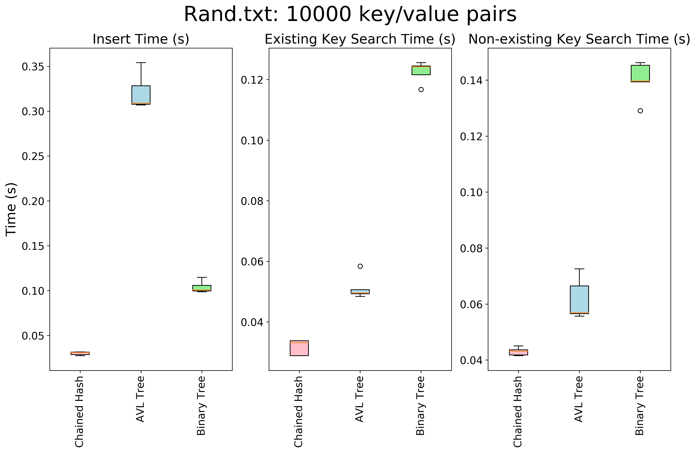
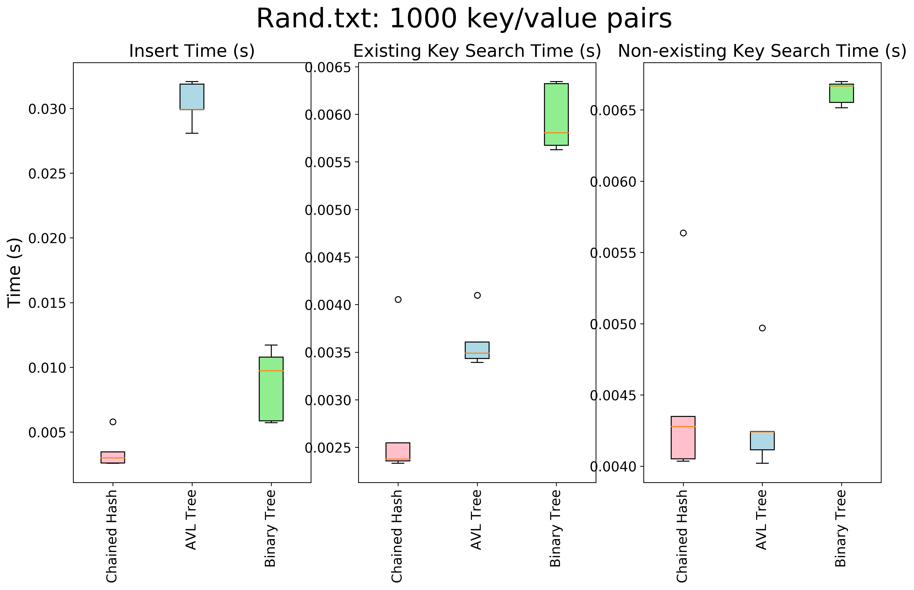
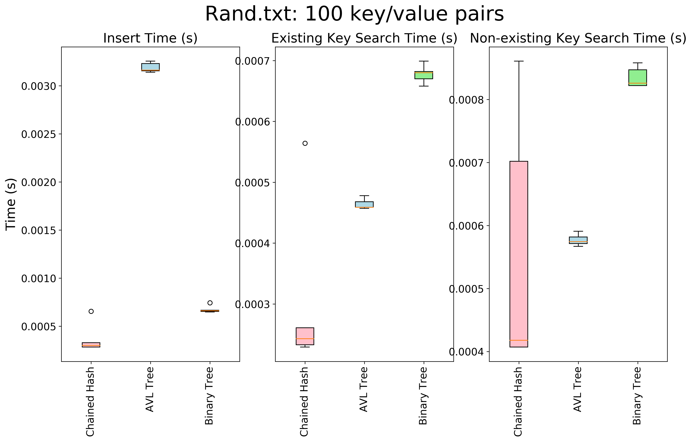

# Trees
Comparing the performance of Binary and AVL trees with a hash table.

## Continuous Integration Status


## Used Packages
To use this package, you need to have Python 3.6 in your environment. Other packages include:
* os
* sys
* time
* argparse
* unittest
* pycodestyle

## Usage
The main program is `insert_key_value_pairs.py`. It benchmarks the time taken to insert and search three data structures: a chained hash table, an AVL Tree, and a Binary Tree. The program can create the structures from either `rand.txt` or `sorted.txt`. Usage is as follows: 

```
python3 insert_key_value_pairs.py --data_structure hash --dataset rand.txt --kv_pairs_number 10000
python3 insert_key_value_pairs.py --data_structure avl_tree --dataset rand.txt --kv_pairs_number 10000
python3 insert_key_value_pairs.py --data_structure binary --dataset rand.txt --kv_pairs_number 10000
```

The program prints out:
1. Time taken to insert
2. Time taken to search for existing keys
3. Time taken to search for non-existing keys

## Results

### Sorted.txt





### Random.txt





## Discussion
These plots show that:
1. Hash tables demonstrate the fastest insertion times, whereas AVL trees demonstrate the slowest insertion times. This can be attributed to the self-balancing performed by AVL trees when insertions occur.
2. AVL trees only outperform hash tables when searching for existing keys in data structures with many sorted key/value pairs. This makes sense, as the chained strategy with an ascii hash would localize many of the keys in the same areas of the data structure.
3. Binary trees typically perform the most poorly when considering search times. This also makes sense, as these trees are not self-balancing (like the AVL tree.) This can lead to lopsided trees that can push search time closer to O(N). 

## Conclusions
Hash tables perform the best when the hash table size is large enough AND the hash function performs well enough to evenly distribute inserted key/value pairs. AVL trees will likely perform the best for very large data sets/keys that are difficult for hash functions to differentiate. Binary trees in the current implementation should never be used; they need self-balancing to be practical.  
